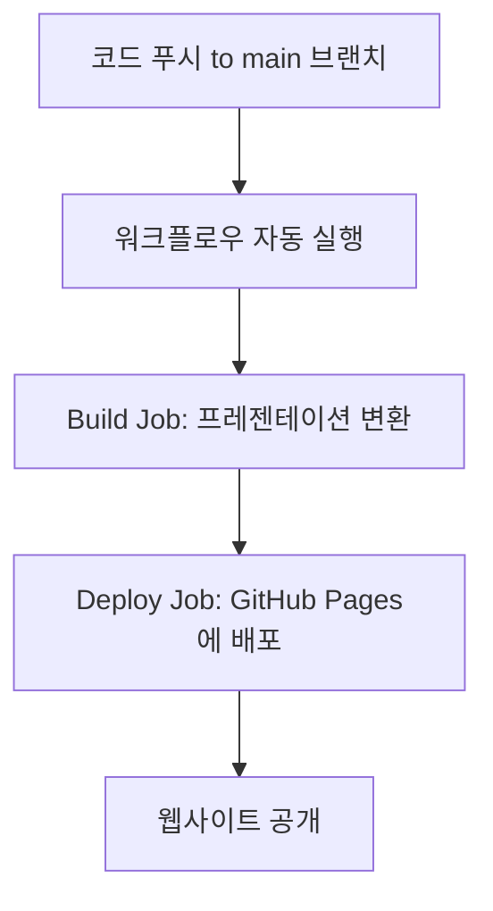
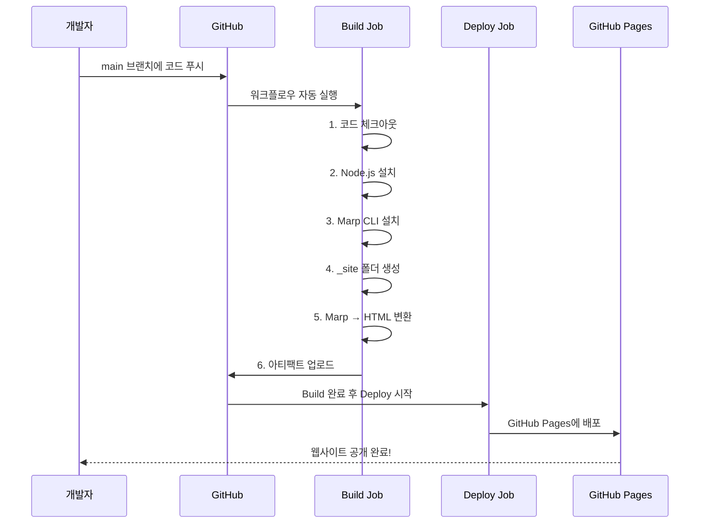

# GitHub Actions 워크플로우 설명서
## Deploy Marp Presentation to GitHub Pages

> [!NOTE]
> 이 문서는 `.github/workflows/deploy-marp.yml` 파일의 내용을 대학생도 쉽게 이해할 수 있도록 설명합니다.

---

## 📚 목차
1. [워크플로우란?](#워크플로우란)
2. [전체 구조 개요](#전체-구조-개요)
3. [상세 설명](#상세-설명)
4. [실행 흐름도](#실행-흐름도)

---

## 워크플로우란?

**GitHub Actions 워크플로우**는 GitHub 저장소에서 자동으로 실행되는 작업 흐름입니다. 
예를 들어:
- 코드를 푸시하면 자동으로 테스트 실행
- 특정 브랜치에 병합하면 자동으로 배포
- 정해진 시간에 자동으로 작업 수행

이 워크플로우는 **Marp 프레젠테이션 파일을 HTML로 변환하여 GitHub Pages에 자동 배포**하는 역할을 합니다.

---

## 전체 구조 개요



---

## 상세 설명

### 1️⃣ 워크플로우 기본 정보

```yaml
name: Deploy Marp Presentation to GitHub Pages
```

**설명**: 이 워크플로우의 이름입니다. GitHub Actions 탭에서 이 이름으로 표시됩니다.

---

### 2️⃣ 실행 조건 (Trigger)

```yaml
on:
  push:
    branches:
      - main
  workflow_dispatch:
```

**언제 실행되나요?**

| 조건 | 설명 |
|------|------|
| `push` → `branches: main` | `main` 브랜치에 코드가 푸시될 때 자동 실행 |
| `workflow_dispatch` | GitHub 웹사이트에서 수동으로 실행 가능 |

> [!TIP]
> `workflow_dispatch`를 추가하면 GitHub Actions 탭에서 "Run workflow" 버튼을 눌러 언제든지 수동 실행할 수 있습니다.

---

### 3️⃣ 권한 설정 (Permissions)

```yaml
permissions:
  contents: read
  pages: write
  id-token: write
```

**각 권한의 의미**:

| 권한 | 설명 |
|------|------|
| `contents: read` | 저장소의 파일을 읽을 수 있는 권한 |
| `pages: write` | GitHub Pages에 배포할 수 있는 권한 |
| `id-token: write` | 보안 토큰을 생성할 수 있는 권한 (배포 시 필요) |

---

### 4️⃣ 동시성 제어 (Concurrency)

```yaml
concurrency:
  group: "pages"
  cancel-in-progress: false
```

**설명**:
- `group: "pages"`: "pages"라는 그룹으로 묶어서 관리
- `cancel-in-progress: false`: 이미 실행 중인 작업이 있어도 취소하지 않음

> [!IMPORTANT]
> 여러 번 푸시해도 배포 작업이 순서대로 실행되어 충돌을 방지합니다.

---

### 5️⃣ Build Job - 프레젠테이션 변환

```yaml
jobs:
  build:
    runs-on: ubuntu-latest
```

**실행 환경**: 최신 Ubuntu Linux 서버에서 실행됩니다.

#### Step 1: 코드 체크아웃

```yaml
- name: Checkout repository
  uses: actions/checkout@v4
```

**역할**: GitHub 저장소의 코드를 작업 서버로 가져옵니다.

---

#### Step 2: Node.js 설치

```yaml
- name: Setup Node.js
  uses: actions/setup-node@v4
  with:
    node-version: '20'
```

**역할**: Node.js 버전 20을 설치합니다.

**왜 필요한가요?** 
- Marp CLI는 Node.js 기반 도구이기 때문에 Node.js가 필요합니다.

---

#### Step 3: Marp CLI 설치

```yaml
- name: Install Marp CLI
  run: npm install -g @marp-team/marp-cli
```

**역할**: Marp 마크다운을 HTML로 변환하는 도구를 전역으로 설치합니다.

**명령어 분석**:
- `npm install`: npm 패키지 설치 명령
- `-g`: 전역(global) 설치 옵션
- `@marp-team/marp-cli`: Marp 공식 CLI 도구

---

#### Step 4: 출력 디렉토리 생성

```yaml
- name: Create output directory
  run: mkdir -p _site
```

**역할**: 변환된 HTML 파일을 저장할 `_site` 폴더를 생성합니다.

**명령어 분석**:
- `mkdir`: 디렉토리 생성 명령
- `-p`: 이미 존재해도 오류 없이 생성

---

#### Step 5: Marp를 HTML로 변환

```yaml
- name: Convert Marp to HTML
  run: |
    marp docs/presentation.md \
      --html \
      --allow-local-files \
      -o _site/index.html
```

**역할**: `docs/presentation.md` 파일을 HTML로 변환하여 `_site/index.html`로 저장합니다.

**옵션 설명**:

| 옵션 | 설명 |
|------|------|
| `docs/presentation.md` | 변환할 입력 파일 |
| `--html` | HTML 태그 사용 허용 |
| `--allow-local-files` | 로컬 이미지/파일 참조 허용 |
| `-o _site/index.html` | 출력 파일 경로 지정 |

> [!NOTE]
> `\` 기호는 명령어가 여러 줄에 걸쳐 있음을 나타냅니다.

---

#### Step 6: 아티팩트 업로드

```yaml
- name: Upload artifact
  uses: actions/upload-pages-artifact@v3
  with:
    path: '_site'
```

**역할**: 변환된 HTML 파일들을 GitHub Pages 배포용 아티팩트로 업로드합니다.

**아티팩트란?** 
- 작업 간에 파일을 전달하기 위한 임시 저장소
- Build Job에서 생성한 파일을 Deploy Job에서 사용할 수 있게 함

---

### 6️⃣ Deploy Job - GitHub Pages 배포

```yaml
deploy:
  environment:
    name: github-pages
    url: ${{ steps.deployment.outputs.page_url }}
  runs-on: ubuntu-latest
  needs: build
```

**주요 설정**:
- `needs: build`: Build Job이 성공적으로 완료된 후에만 실행
- `environment`: GitHub Pages 환경으로 배포
- `url`: 배포된 페이지의 URL을 자동으로 가져옴

---

#### Step: GitHub Pages에 배포

```yaml
- name: Deploy to GitHub Pages
  id: deployment
  uses: actions/deploy-pages@v4
```

**역할**: 업로드된 아티팩트를 GitHub Pages에 실제로 배포합니다.

**결과**: 
- 웹사이트가 `https://<username>.github.io/<repository-name>/`에 공개됩니다.

---

## 실행 흐름도



---

## 💡 실제 사용 예시

### 시나리오: 프레젠테이션 업데이트

1. **로컬에서 작업**
   ```bash
   # presentation.md 파일 수정
   git add docs/presentation.md
   git commit -m "프레젠테이션 내용 업데이트"
   git push origin main
   ```

2. **자동 실행**
   - GitHub Actions가 자동으로 워크플로우 실행
   - 약 1-2분 후 변환 및 배포 완료

3. **결과 확인**
   - `https://tlstn3172.github.io/national-pension-demo/`에서 업데이트된 프레젠테이션 확인

---

## 🔧 문제 해결

### 워크플로우가 실행되지 않는 경우

> [!WARNING]
> GitHub 저장소 설정에서 Actions가 활성화되어 있는지 확인하세요.

**확인 방법**:
1. 저장소 → Settings → Actions → General
2. "Allow all actions and reusable workflows" 선택

### 배포는 성공했지만 페이지가 보이지 않는 경우

> [!CAUTION]
> GitHub Pages 설정을 확인해야 합니다.

**확인 방법**:
1. 저장소 → Settings → Pages
2. Source: "GitHub Actions" 선택
3. 저장 후 몇 분 대기

---

## 📖 용어 정리

| 용어 | 설명 |
|------|------|
| **Workflow** | 자동화된 작업 흐름 |
| **Job** | 워크플로우 내의 독립적인 작업 단위 |
| **Step** | Job 내의 개별 실행 단계 |
| **Artifact** | 작업 간 파일 전달을 위한 임시 저장소 |
| **Marp** | 마크다운으로 프레젠테이션을 만드는 도구 |
| **GitHub Pages** | GitHub에서 제공하는 무료 웹 호스팅 서비스 |

---

## 🎓 학습 포인트

1. **자동화의 중요성**: 수동으로 HTML 변환 → 업로드하는 과정을 자동화
2. **CI/CD 개념**: 코드 푸시만으로 자동 배포되는 현대적 개발 방식
3. **YAML 문법**: 설정 파일 작성 방법 학습
4. **Job 의존성**: `needs` 키워드로 작업 순서 제어

---

## 📚 추가 학습 자료

- [GitHub Actions 공식 문서](https://docs.github.com/en/actions)
- [Marp 공식 문서](https://marp.app/)
- [GitHub Pages 가이드](https://pages.github.com/)

---

**작성일**: 2025-12-23  
**대상**: 대학생 및 초보 개발자  
**난이도**: ⭐⭐☆☆☆ (초급-중급)
